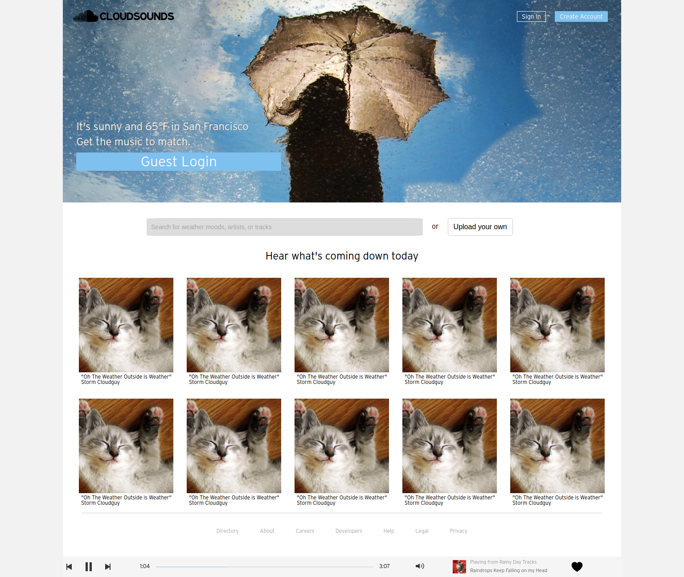
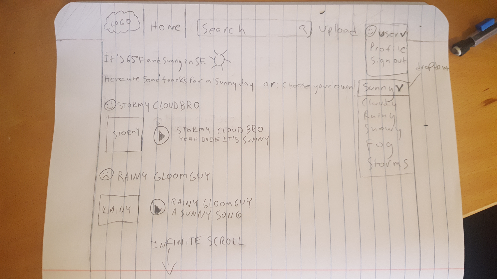

## Heroku Link

[cloudsounds.io](http://cloudsounds.io)

##Minimum Viable Product

Song CRUD

Continuous play while navigating site

Comments

User pages

Bonus: Playlists for particular weather

Bonus: Likes

##Wireframes

###Splash Page
-Player will have a fixed position at the bottom of the window.

-Login and Signup forms will pop in as modal overlays

###Stream
-First thing user sees when they log in.

-Autopopulates with the tracks tagged with the weather from their current location (defaults to SF if they don't authorize location tracking).

-User can select their 'weather mood' from a dropdown to populate the stream with different tracks.

-Infinite scroll (Bonus Feature)

[Live Demo](http://cloudsounds.io)

##Track#show
-Cover photo pertains to the track's weather mood.

-Right side of content area shows list of other tracks for the weather mood.

-Left side shows track art

-Center is track info, description and comments.

