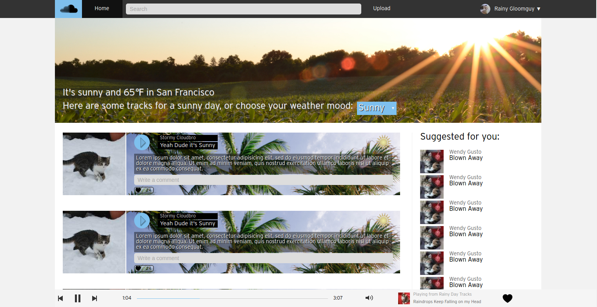
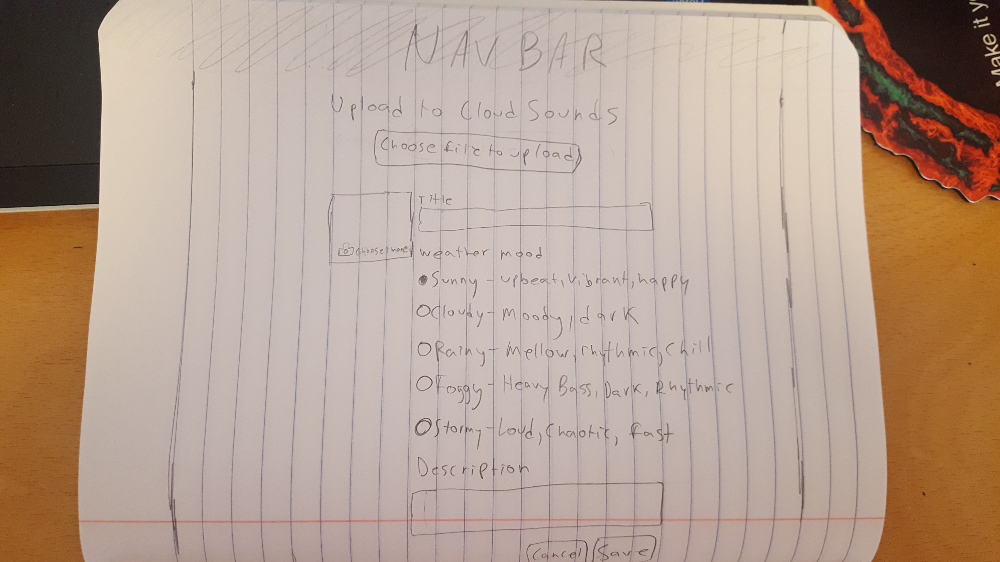
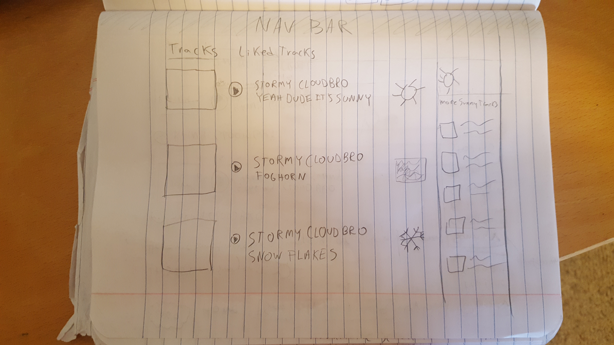

##Wireframes

###Splash Page
-Player will have a fixed position at the bottom of the window.

-Login and Signup forms will pop in as modal overlays

[Live Mock Up](http://cloudsounds.io)

###Home
-First thing user sees when they log in.

-Autopopulates with the tracks tagged with the weather from their current location (defaults to SF if they don't authorize location tracking).

-User can select their 'weather mood' from a dropdown to populate the stream with different tracks.

-Infinite scroll (Bonus Feature)

Live mock up with a little more detail:

[Live Mock Up](http://cloudsounds.io/pages/home)

##Track#show
-Cover photo pertains to the track's weather mood.

-Right side of content area shows list of other tracks for the weather mood.

-Left side shows track art

-Center is track info, description and comments.

##Track#new
-Files, images hosted on Cloudinary

-Users inputs title, weather mood, description.

##Track#edit
-Modal overlay with track form. Accessed from user#show

##User#show
-Displays tracks user has uploaded and tracks they have liked.

-If current user is looking at their own show page, they can click their avatar picture to edit their photo.

